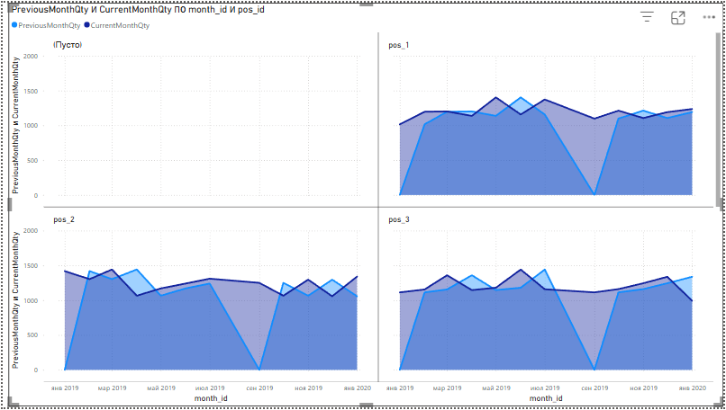

# ТЕСТОВОЕ ЗАДАНИЕ от SDS

### Подготовка к выполнению задач № 1-5

#### Для локальной разработки (тестирования), развернем БД используя docker compose. Также для администрирования БД, развернем adminer. 
```dockerfile
version: '3.7'

services:

  mysql:
    container_name: mysql_container
    image: mysql:8
    restart: always
        ports:
      - "3306:3306"
    environment:
      MYSQL_ROOT_PASSWORD: mysql
      MYSQL_DATABASE: mysql
      MYSQL_USER: mysql
      MYSQL_PASSWORD: mysql
    volumes:
      - ./dbdata:/var/lib/mysql/
    networks:
      - mysql_net

  adminer:
    container_name: adminer_container
    image: adminer
    depends_on:
      - mysql
    ports:
      - "10100:8080"
    networks:
        - mysql_net

networks:
    mysql_net:
        driver: bridge

```

#### Подключимся к mysql через adminer и создадим тестовую БД и заполним ее

```sql
create database if not exists dbo;

--

CREATE TABLE if not exists dbo.Categories (
CategoryID int NOT NULL AUTO_INCREMENT,
CategoryName nvarchar(255),
CONSTRAINT PK_Categories PRIMARY KEY (CategoryID));

--

CREATE TABLE if not exists  dbo.Products (
ProductID int NOT NULL AUTO_INCREMENT,
ProductName nvarchar(255),
CategoryID int,
CONSTRAINT PK_Products PRIMARY KEY (ProductID),
CONSTRAINT FK_Categories_On_Products FOREIGN KEY (CategoryID)
REFERENCES dbo.Categories (CategoryID)
ON DELETE NO ACTION ON UPDATE NO ACTION);

--

CREATE TABLE if not exists dbo.Partners(PartnerID int NOT NULL AUTO_INCREMENT, 
PartnerName nvarchar(255), Status nvarchar(50),
CONSTRAINT PK_Partners PRIMARY KEY (PartnerID));

--

CREATE TABLE if not exists dbo.Orders (
OrderID int NOT NULL AUTO_INCREMENT,
OrderDate date,
ProductID int,
PartnerID int,
Quantity int,
Amount decimal(18,2),
CONSTRAINT PK_Orders PRIMARY KEY (OrderID),
CONSTRAINT FK_Products_On_Orders FOREIGN KEY (ProductID)
REFERENCES dbo.Products (ProductID)
ON DELETE NO ACTION ON UPDATE NO ACTION,
CONSTRAINT FK_Partners_On_Orders FOREIGN KEY (PartnerID)
REFERENCES dbo.Partners (PartnerID)
ON DELETE NO ACTION ON UPDATE NO ACTION);

--
INSERT INTO dbo.Categories (CategoryName) VALUES
('Бытовая техника'),
('Мобильные устройства'),
('Компьютеры');


INSERT INTO dbo.Products (ProductName, CategoryID) VALUES
('Холодильник', 1),
('Стиральная машина', 1),
('Смартфон', 2),
('Планшет', 2),
('Ноутбук', 3);


INSERT INTO dbo.Partners (PartnerName, Status) VALUES
('Партнер 1', 'Дистрибьютор'),
('Партнер 2', 'Дилер'),
('Партнер 3', 'Дилер');


INSERT INTO dbo.Orders (OrderDate, ProductID, PartnerID, Quantity, Amount) VALUES
('2023-01-10', 1, 1, 3, 60000.00),
('2023-01-15', 2, 2, 2, 36000.00),
('2023-02-05', 3, 3, 5, 40000.00),
('2023-02-10', 4, 1, 1, 22000.00),
('2023-03-12', 5, 2, 4, 200000.00),
('2023-03-20', 1, 3, 1, 20000.00),
('2023-04-01', 2, 1, 3, 54000.00),
('2023-04-15', 3, 2, 7, 56000.00),
('2023-05-05', 4, 3, 2, 44000.00),
('2023-05-10', 5, 1, 3, 150000.00),
('2023-06-12', 1, 2, 2, 40000.00),
('2023-06-25', 2, 3, 4, 72000.00),
('2023-07-05', 3, 1, 6, 48000.00),
('2023-07-15', 4, 2, 3, 66000.00),
('2023-08-01', 5, 3, 5, 250000.00);
```

## SQL

**Пояснение, в данном разделе я выполнял задание используя Adminer, код представлен в формате markdown**

### Задача №  1 Напишите запрос для вычисления средней цены реализации за единицу в разрезе категорий в первом полугодии 2023 года.

**Решение**

```sql
select
    dbo.Categories.CategoryName as 'Название категории',
    temp._mean as 'Средняя цена'
    from (select 
            dbo.Products.CategoryID,
            ROUND(sum(dbo.Orders.Amount) / sum(dbo.Orders.Quantity), 2) as _mean
        from dbo.Orders
        left join dbo.Products 
        on dbo.Orders.ProductID = dbo.Products.ProductID
        where MONTH(dbo.Orders.OrderDate) < 7 and YEAR(dbo.Orders.OrderDate) = 2023
        group by dbo.Products.CategoryID) as temp 
    left join dbo.Categories
    on dbo.Categories.CategoryID = temp.CategoryID
```

**Ответ**
|      Название категории  |    Средняя цена   |
|--------------------------|-------------------|
|       Бытовая техника	   |      18800.00     |
|    Мобильные устройства  |      10800.00     |
|         Компьютеры	   |      50000.00     |

### Задача №  2 Вывести товары, для которых цена реализации за весь период продаж ниже средней цены по всем товарам. Используйте WITH конструкцию.

**Решение**

```sql
with amount_one as (
    select 
        _max_price_date,
        ProductName
    from 
        (select round(max(_max_price_date),2) as _max_price_date, ProductID
        from 
            (select max(dbo.Orders.Amount / dbo.Orders.Quantity) as _max_price_date,
                    dbo.Orders.ProductID as ProductID
                from dbo.Orders
                group by dbo.Orders.ProductID, dbo.Orders.OrderDate) as temp
        group by ProductID) as temp_2
    left join dbo.Products 
    on temp_2.ProductID = dbo.Products.ProductID )

select
    ProductName as 'Название товара'
from amount_one 
where amount_one._max_price_date < round((select sum(_max_price_date) from amount_one) / (select count(_max_price_date) from amount_one), 2)
```


|   Название товара  |
|--------------------|
|    Холодильник     |
|  Стиральная машина |
|      Смартфон      |
|       Планшет      |

### Задача №  3 Определить какая категория товаров наиболее популярна (по объему продаж) у партнеров со статусом Дистрибьютор.

**Решение**

```sql
with temp as (
    select 
        sum(Quantity) as _,
            CategoryName
    from dbo.Categories
    join dbo.Products
    on dbo.Categories.CategoryID = dbo.Products.CategoryID
    join dbo.Orders
    on dbo.Products.ProductID = dbo.Orders.ProductID
    join dbo.Partners
    on dbo.Orders.PartnerID = dbo.Partners.PartnerID
    where dbo.Partners.Status = 'Дистрибьютор'
    group by dbo.Categories.CategoryID)

select
    CategoryName as 'Название категории'
from temp
where _ = (select max(_) from temp)
```

|  Название категории    |
|------------------------|
|  Мобильные устройства  |

### Задача №  4 Найти партнеров с наибольшим объемом продаж в каждом месяце.

**Решение**

```sql
with temp as (
    select
        DATE_FORMAT(OrderDate, '%Y-%m') AS Month_,
        sum(Quantity) as quantity_,
        dbo.Partners.PartnerName as name_
    from dbo.Orders
    join dbo.Partners
    on dbo.Orders.PartnerID = dbo.Partners.PartnerID
    group by dbo.Orders.OrderDate, dbo.Partners.PartnerName),
    temp_2 as (
        select
            month_,
            name_,
            rank() over (partition by month_ order by quantity_ desc) as rank_
        from temp
    )

select
    month_ as 'Месяц покупки',
    name_ as 'Имя партнера'
from temp_2
where rank_ = 1
```

| Месяц покупки | Имя партнера |
|---------------|--------------|
| 2023-01       | Партнер 1    |
| 2023-02       | Партнер 3    |
| 2023-03       | Партнер 2    |
| 2023-04       | Партнер 2    |
| 2023-05       | Партнер 1    |
| 2023-06       | Партнер 3    |
| 2023-07       | Партнер 1    |
| 2023-08       | Партнер 3    |

### Задача №  5* Дана следующая таблица с данными:
```sql
CREATE TABLE dbo.Table_1(ID int);

INSERT INTO dbo.Table_1 VALUES
(1), (2), (3), (7), (8), (9), (11), (12), (14), (15);
```
Наиболее лаконичным кодом (без курсоров и т.п.) необходимо написать скрипт, который бы показывал начало и окончание последовательности.

| FirstID | LastID |
|---------|--------|
| 1       | 3      |
| 7       | 9      |
| 11      | 12     |
| 14      | 15     |


```python
# Реализация на Python для понимания сути задания
# и для тестирования на локальной машине
# (не является частью решения на SQL)
arr_ = [1, 2, 3, 7, 8, 9, 11, 12, 14]

def find_consecutive(arr_: list) -> list:
    # Хранит весь ответ
    aswer = []
    count = 0
    temp_ = []
    for i in arr_:
        # Если это первый элемент, то просто добавляем его в список
        if count == 0:
            temp_.append(i)
            count += 1
        # Если это второй элемент, то проверяем разницу между ними
        # Если разница равна 1, то добавляем его в список
        elif count > 0 and i - temp_[count - 1] == 1:
            temp_.append(i)
            count += 1
        # Если разница больше 1, то просто добавляем его в список
        # и обнуляем счетчик
        elif count > 0 and i - temp_[count - 1] > 1:
            if len(temp_) > 1:
                aswer.append([temp_[0], temp_[-1]])
            temp_ = []
            count = 0
            temp_.append(i)
            count += 1
    return aswer
```


```python
find_consecutive(arr_)
```
    [[1, 3], [7, 9], [11, 12]]

``` sql
-- Нумеруем порядковыми номерами столбцы
WITH temp AS (
    SELECT
        ID AS id,
        ROW_NUMBER() OVER (ORDER BY id) AS real_id
    FROM dbo.Table_1
),

-- Считаем дельту
temp_2 AS (
    SELECT
        id,
        real_id,
        id - real_id AS delta
    FROM temp
),

-- Группируем и агрегируем массив
temp_3 AS (
    SELECT
        JSON_ARRAYAGG(id) AS res
    FROM temp_2
    GROUP BY delta
)

-- Извлекаем первый и последний элемент из каждого JSON-массива
SELECT
    JSON_UNQUOTE(JSON_EXTRACT(res, '$[0]')) AS first_id,
    JSON_UNQUOTE(JSON_EXTRACT(res, CONCAT('$[', JSON_LENGTH(res) - 1, ']'))) AS last_id
FROM temp_3;
```

## Python

### Задача Решите задачу №4 из блока SQL используя библиотеку Pandas. Создайте и заполните данными Pandas Dataframe вручную или импортируйте таблицу через подключение к вашей БД на локальном диске.


```python
import pandas as pd
import sqlalchemy as sa
from sqlalchemy import create_engine, text, URL

# Определяем параметры подключения к базе данных
connection_params = {
    "drivername": "mysql+pymysql",
    "host": "localhost",
    "port": 3306,
    "database": "dbo",
    "username": "root",
    "password": "mysql",
}
```


```python
# Создаем строку подключения
url_ = URL.create(
    drivername=connection_params["drivername"],
    host=connection_params["host"],
    port=connection_params["port"],
    database=connection_params["database"],
    username=connection_params["username"],
    password=connection_params["password"],
)
```


```python
# Создаем движок для подключения к базе данных
engine = create_engine(url_)
```


```python
# Определяем запрос 
query = text("select " \
"OrderDate, " \
"Quantity, " \
"dbo.Partners.PartnerName " \
"from dbo.Orders " \
"join dbo.Partners " \
"on dbo.Orders.PartnerID = dbo.Partners.PartnerID;")
```


```python
# Через контекстный менеджер создаем соединение с базой данных
df = pd.DataFrame()
with engine.connect() as connection:
    # Выполняем SQL-запрос и получаем результат в виде DataFrame
    df = pd.read_sql(query, connection)
    print(df.head())  # Выводим первые 5 строк DataFrame
```

        OrderDate  Quantity PartnerName
    0  2023-01-10         3   Партнер 1
    1  2023-02-10         1   Партнер 1
    2  2023-04-01         3   Партнер 1
    3  2023-05-10         3   Партнер 1
    4  2023-07-05         6   Партнер 1


```python
for_work = df.copy()
```


```python
# Преобразуем формат даты в нужный вид
for_work['OrderDate'] = pd.to_datetime(for_work['OrderDate'], format='%Y-%m').dt.strftime('%Y-%m')

# 1. Группируем данные по дате и имени партнера
# 2. Применяем аггрегационную функцию sum к количеству
#       для получения суммарного количества проданных товаров у партнера
# 3. Группируем данные по дате и применяем аггрегационную функцию max 
# к количеству для получения максимального значения в группе месяц
for_work = for_work.groupby(['OrderDate', 'PartnerName']) \
    .agg({'Quantity': 'sum'})

# Добавляем дополнительный столбец с максимальным значением количества товаров в группе
for_work['MaxInGroup'] = for_work.groupby(['OrderDate'])['Quantity'].transform('max')

# Отбираем только те строки, где количество равно максимальному значению в группе
# и сбрасываем индексы
for_work = for_work.loc[for_work['Quantity'] == for_work['MaxInGroup']] \
    .reset_index()[['OrderDate', 'PartnerName']]
```

| OrderDate | PartnerName |
|-----------|-------------|
| 2023-01   | Партнер 1   |
| 2023-02   | Партнер 3   |
| 2023-03   | Партнер 2   |
| 2023-04   | Партнер 2   |
| 2023-05   | Партнер 1   |
| 2023-06   | Партнер 3   |
| 2023-07   | Партнер 1   |
| 2023-08   | Партнер 3   |

## Power BI

### Задача № 1 Добавьте визуальный элемент с отслеживанием отношения факта к предыдущему месяцу.


Для решения данной задачи, был выбран элемент визуализации типа "Диаграмма с областями". 
Необходимо было вычислить агрегированное значение по столбцу fact_qty:
```
CurrentMonthQty = SUM('fact'[fact_qty])
``` 
Мы получаем автоматический расчет агрегированных значений с добавлением новых элементов в таблицу.
После чего, сдвигаем значения на один месяц назад используя следующую меру:
``` 
PreviousMonthQty = 
COALESCE(
    CALCULATE(
        SUM('fact'[fact_qty]),
        PREVIOUSMONTH('fact'[month_id])), 0)
```
После добавления на элемент визуализации, можем наблюдать следующее:   





### Задача №2 Добавьте визуальный элемент с отслеживанием факта к плану, как по суммарному плану, так и по Main


### Задача №3 Для последнего месяца (02-2021), отсутствует Факт, предусмотреть поле ввода, для указания "прогнозного факта за месяц", для расчёта прогнозного % выполнения плана.


### Задача №4 Добавьте визуальный элемент с динамикой продаж по точкам (pos) и товарам(item).


### Задача №5* Необходимо реализовать видимость отдельного (произвольного) визуального элемента / страницы с произвольными визуальными элементами для ограниченного списка пользователей – sds\user1, sds \user3. Для пользователей c другими USERNAME() данные должны быть невидимы.


